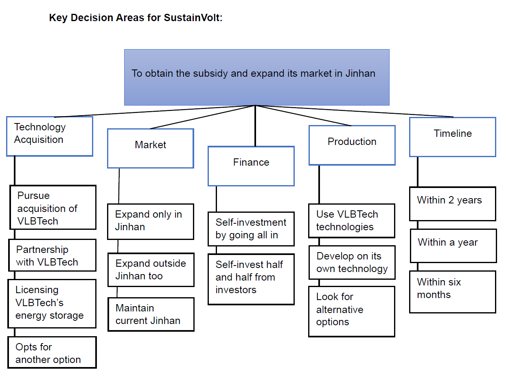
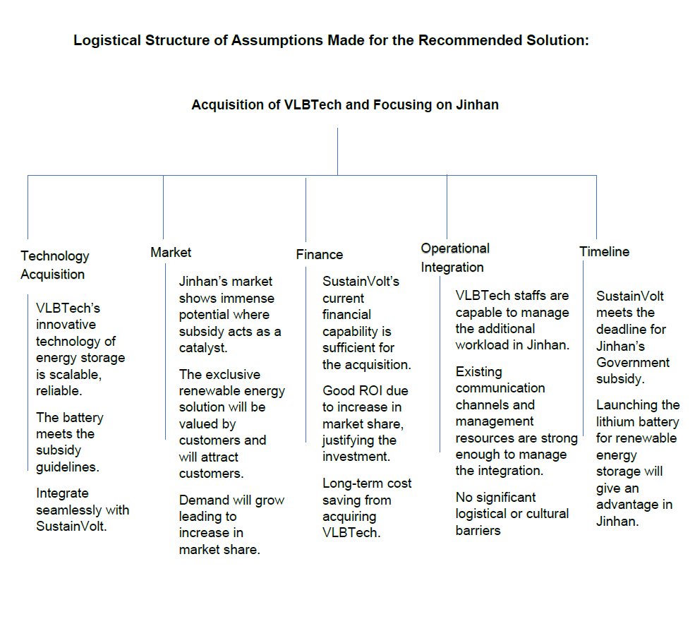

# Strategic Acquisition Analysis for Renewable Energy Expansion

## Project Overview

This project evaluates strategic options for a renewable energy company seeking to expand market share and secure government subsidies through access to advanced battery storage technology.

## Business Problem

A renewable energy provider held a strong domestic market position but lacked battery storage capabilities required to qualify for government incentives in a high-growth international market.

The objective was to determine the most effective strategy for obtaining energy storage technology while maximising market expansion opportunities.

## Objectives

- Evaluate acquisition feasibility
- Compare strategic alternatives
- Assess implementation risks
- Identify critical business assumptions
- Recommend an evidence-based strategic solution

## Methodology

### Opportunity Analysis
- Stakeholder Analysis
- Success Criteria Definition
- Constraint Assessment

### Strategic Options Evaluated
1. Full Acquisition
2. Strategic Partnership
3. Technology Licensing

### Additional Analysis
- Assumption Mapping
- Risk Assessment
- Cultural Integration Review

## Key Findings

- Acquisition provides the strongest long-term competitive advantage.
- Exclusive ownership creates market differentiation.
- Government subsidy access significantly improves growth potential.
- Cultural integration planning is essential for acquisition success.

## Recommendation

Proceed with acquisition of the battery technology provider to secure exclusive access to energy storage capabilities and strengthen long-term market position.

## Skills Demonstrated

- Business Analysis
- Strategic Planning
- Stakeholder Management
- Risk Assessment
- Decision-Making Frameworks
- Consulting Analysis

## Tools Used

- Microsoft PowerPoint
- Strategic Analysis Frameworks
- Decision Modelling

## Future Enhancements

- Decision Matrix Model
- Financial ROI Analysis
- Power BI Executive Dashboard

## Key Decision Framework

## Assumption Framework

